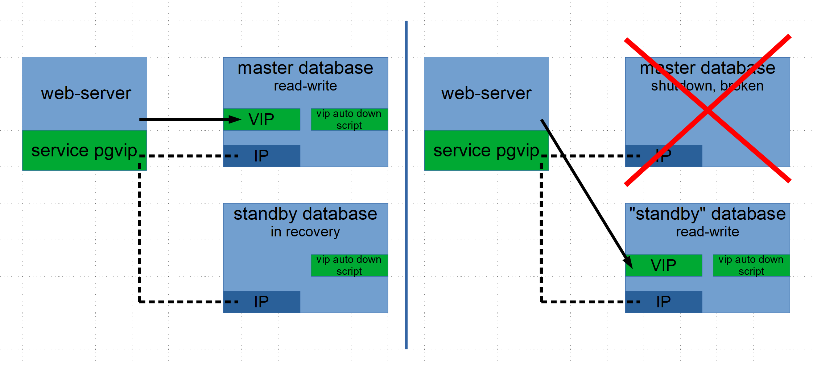

## PGVIP | PostgreSQL master-standby auto failover

PGVIP - auto failover service from master to standby PostgreSQL database using virtual (floating) IP address

The service is installed on one server, which is a [single point of failure](https://en.wikipedia.org/wiki/Single_point_of_failure) (example, nginx proxy), or on any two servers (hereinafter referred to as web servers).
There is no need to install anything on the database servers; the web server connects to them via ssh and executes commands from the configuration file.

<b>Failover schema</b>



Technically, the PGVIP service is implemented as a wrapper that executes operating system commands from a configuration file.
It was originally developed as a bash script, then rewritten in C language.

  
**Main actions** performed by the pgvip service:

*   checking the availability of the master database and the lag of the standby database, the status of the virtual IP address (up/down)
*   managing a virtual IP address, running a script to automatically turn it off (necessary if the connection is lost)
*   activation (promotion) of a standby database and transfer of a virtual IP address

Documentation in file [doc/documentation.html](https://htmlpreview.github.io/?https://github.com/PGSuite/PGVIP/blob/main/doc/documentation.html)  

Overview on site [pgvip.org](https://pgvip.org/en/)

### Installation ### 

PGVIP is installed only on web servers, not on database servers.

0\. Preparation  
    reserve a virtual IP address (for example, in the DHCP server)  
    set up ssh connection via key from web server to database servers  

1\. Clone repository  
```git clone https://github.com/PGSuite/PGVIP.git```  
```cd PGVIP```  

2\. Make  
```make```

3\. Install  
```make install ip_master=[ip_master] ip_standby=[ip_standby] ip_virtual=[ip_virtual] subnet_mask=[subnet_mask] ```

4\. Start service  
```systemctl --now enable pgvip ```

5\. Check status and system log  
```systemctl status pgvip ```
```pgvip status ```
```journalctl -fu pgvip ```

6\. View run-time configuration with the final OS commands
```pgvip show config ```


### Failover example ### 

```bash
[root@web-server ~]# pgvip status
status: SUCCESS (duration: 0 00:00:32)

+---------+--------------+-------------------------+---------------+---------------+
| Role    | IP address   | Database state          | 192.168.56.10 | VIP auto down |
+---------+--------------+-------------------------+---------------+---------------+
| master  | 192.168.56.1 | read-write              | up on enp0s3  | executing     |
| standby | 192.168.56.2 | in recovery, lag 0 min. | down          | executing     |
+---------+--------------+-------------------------+---------------+---------------+


[root@web-server ~]# pgvip status
status: ERROR (duration: 0 00:00:14, cause: master db is not read-write)

+---------+--------------+-------------------------+---------------+---------------+
| Role    | IP address   | Database state          | 192.168.56.10 | VIP auto down |
+---------+--------------+-------------------------+---------------+---------------+
| master  | 192.168.56.1 | not available           | not available | not available |
| standby | 192.168.56.2 | in recovery, lag 0 min. | down          | executing     |
+---------+--------------+-------------------------+---------------+---------------+


[root@web-server ~]# pgvip status
status: STANDBY_PROMOTED (duration: 0 00:00:06)

+---------+--------------+----------------+---------------+---------------+
| Role    | IP address   | Database state | 192.168.56.10 | VIP auto down |
+---------+--------------+----------------+---------------+---------------+
| master  | 192.168.56.1 | not available  | not available | not available |
| standby | 192.168.56.2 | read-write     | up on enp0s3  | executing     |
+---------+--------------+----------------+---------------+---------------+
```

### Important qualities ### 

*   **Any standby database** - there are no requirements for a standby database. The standby database may have a lag (recovery\_min\_apply\_delay parameter), using WAL segment files from backup (restore\_command parameter) without creating a replication slot
*   **Direct connection** - the virtual IP address is activated (up) on the network interface with the physical address, connection to the database occurs without intermediate layers
*   **No DBA required** - installation and configuration can be performed by a system administrator at the junior level, modification - by a system administrator at the middle level
*   **Easy installation** - installation consists of two operations: setting up ssh keys and executing the _make install_ command
*   **Making is optional** - making has already been completed, because does not depend on Linux versions and does not require additional libraries. If necessary, executed with one _gcc_ command
*   **All commands are customizable** - pgvip service only executes operating system commands from the configuration file. To check, the administrator can execute any in command line
*   **Obvious action log** - When an action is executed, printed to log: action name, condition, status (_pgvip status_), OS command with output. The action name and condition are actual C code snippets from the action.c file, obtained by the macro #define #\[name\]
*   **Actions without history** - actions are performed only depending on the current status, it is possible not to save information about the state of databases and do not synchronize web servers

### Support ### 

Of course you can create an issue, I will answer all requests.  
Also I will help to install and use the tool.  
Welcome to discussion !  

WhatsApp: [PGSuite (+7-936-1397626)](https://wa.me/79361397626)  
email: [support\@pgsuite.org](mailto:support@pgsuite.org?subject=PGXLS)

